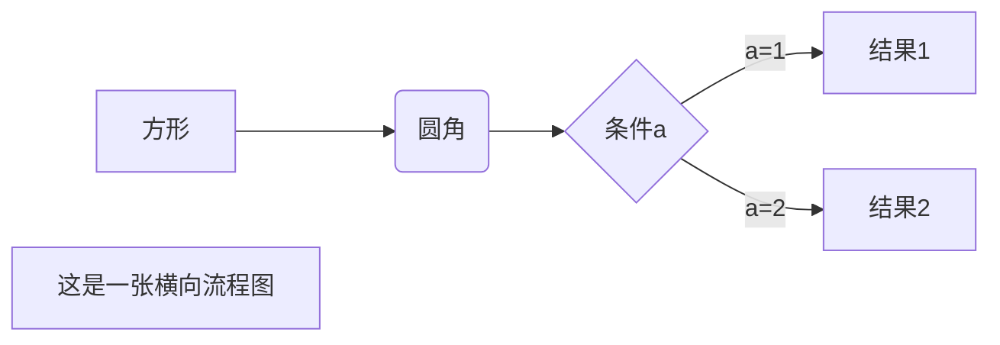
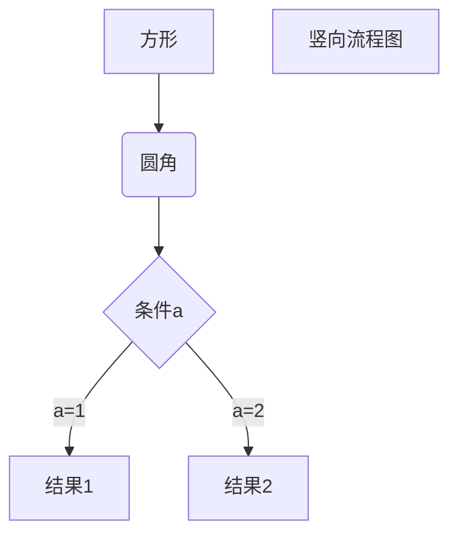
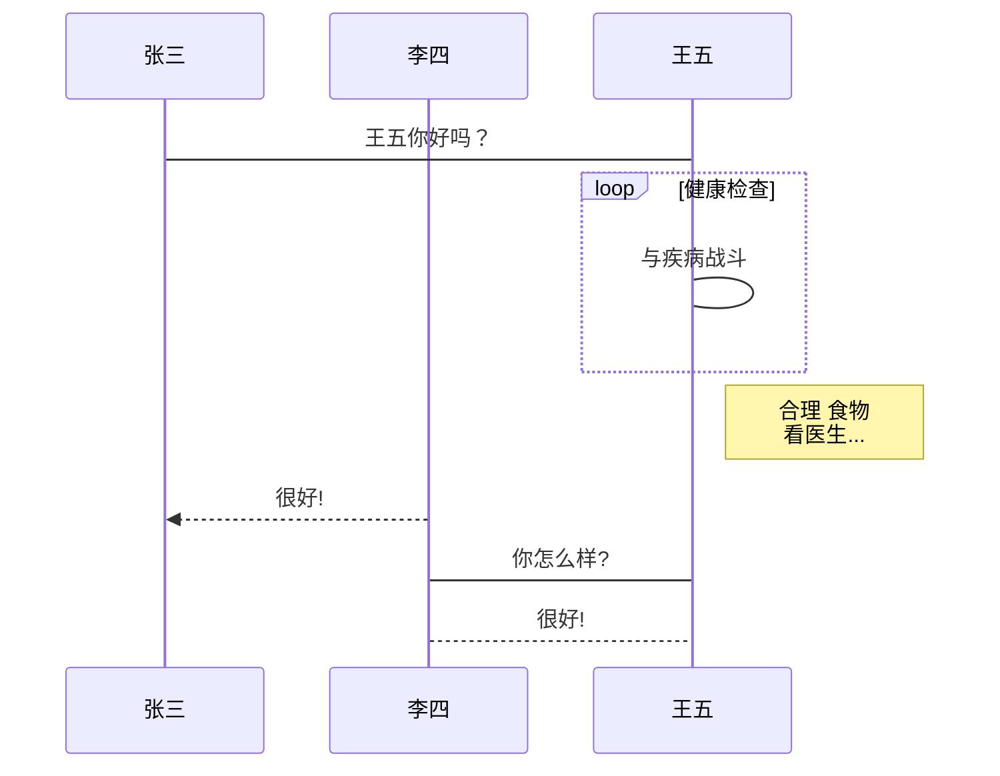
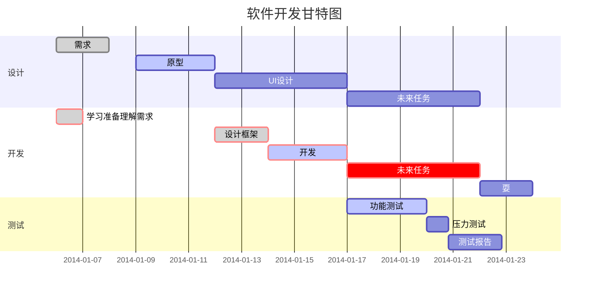

---
by ken
---

[TOC]

# Markdown/Typora教程

> Typora 一直是我认为桌面端笔记应用应有的终极形态。用我之前 [一篇文章](https://sspai.com/post/54122) 中的话来说就是，「它的**功能之强大、设计之冷静、体验之美妙、理念之先进**，我认为值得所有笔记应用厂商学习。」
>
> Typora 是一款**支持实时预览的 Markdown 文本编辑器**。它有 OS X、Windows、Linux 三个平台的版本，并且由于仍在测试中，是**完全免费**的。Markdown 是用来编写结构化文档的一种纯文本格式，它使我们在双手不离开键盘的情况下，可以对文本进行一定程度的格式排版。
>
> 由于目前还没有一个权威机构对 Markdown 的语法进行规范，各应用厂商制作时遵循的 Markdown 语法也是不尽相同的。其中比较受到认可的是 [GFM 标准](https://github.github.com/gfm/)，它是由著名代码托管网站 [GitHub](https://github.com/) 所制定的。Typora 主要使用的也是 GFM 标准。同时，你还可以在 `文件 - 偏好设置 - Markdown 语法偏好 - 严格模式` 中将标准设置为「更严格地遵循 GFM 标准」。具体内容你可以在官方的 [这篇文档](http://support.typora.io/Strict-Mode/) 中查看。

http://support.typora.io/Strict-Mode/

[Typora 完全使用详解 - 少数派](https://sspai.com/post/54912/)

# Markdown 教程

---

Markdown 是一种**轻量级标记语言**，它允许人们使用**易读易写的纯文本格式编写文档**。

Markdown 语言在2004年'由约翰·格鲁伯（英语：John Gruber）创建。

Markdown 编写的文档可以导出 **HTML** 、**Word**、**图像**、**PDF**、**Epub** 等多种格式的文档。

Markdown 编写的文档后缀为 **`.md`**, **`.markdown`**。

---

## Markdown 应用

Markdown 能被使用来撰写电子书，如：Gitbook。

当前许多网站都广泛使用`Markdown`来撰写帮助文档或是用于论坛上发表消息。例如：GitHub、简书、reddit、Diaspora、Stack Exchange、OpenStreetMap 、SourceForge等。

---

## 编辑器

本教程将使用 Typora 编辑器来讲解 Markdown 的语法，Typora 支持 MacOS 、Windows、Linux 平台，且包含多种主题，编辑后直接渲染出效果。

支持导出HTML、PDF、Word、图片等多种类型文件。

Typora 官网：https://typora.io/

你也可以使用我们的在线编辑器来测试：[https://c.runoob.com/front-end/712](https://c.runoob.com/front-end/712)。

---

## 有用的书籍

《了不起的Markdown》：

- [京东](https://item.jd.com/12669274.html)
- [当当](http://product.dangdang.com/27912444.html)

---

## 测试实例

Mardown 编写 Hello World! 语法：`# Hello World!`

将该代码格式粘贴到 Typora 效果如下：


# Markdown 标题

## 1、使用 = 和 - 标记一级和二级标题

= 和 - 标记语法格式如下：  

```markdown
我展示的是一级标题
=================

我展示的是二级标题
-----------------
```

显示效果如下图：


## **使用 # 号标记**

使用 **`#`** 号可表示 1-6 级标题，一级标题对应一个 **`#`** 号，二级标题对应两个 **`#`** 号，以此类推。

```markdown
# 一级标题
## 二级标题
### 三级标题
#### 四级标题
##### 五级标题
###### 六级标题
```

显示效果如下图：


# Markdown 段落格式

## Markdown 段落

Markdown 段落没有特殊的格式，直接编写文字就好，**段落的换行是使用两个以上空格加上回车**。


---

## 字体

Markdown 可以使用以下几种字体：

```
*斜体文本*
_斜体文本_
**粗体文本**
__粗体文本__
***粗斜体文本***
___粗斜体文本___
```

显示效果如下所示：


---

## 分隔线

你可以在一行中用三个以上的星号、减号、底线来建立一个分隔线，行内不能有其他东西。你也可以在星号或是减号中间插入空格。下面每种写法都可以建立分隔线:

```
***

* * *

*****

- - -

----------
```

显示效果如下所示：


---

## 删除线

如果段落上的文字要添加删除线，只需要在文字的两端加上两个波浪线 **~~** 即可，实例如下：

```
RUNOOB.COM
GOOGLE.COM
~~BAIDU.COM~~
```

显示效果如下所示：


---

## 下划线

下划线可以通过 HTML 的 **<u>** 标签来实现：

```
<u>带下划线文本</u>
```

显示效果如下所示：


---

## 脚注

**脚注是对文本的补充说明。**

Markdown 脚注的格式如下:

```
[^要注明的文本]
```

以下实例演示了脚注的用法：

```markdown
创建脚注格式类似这样 [^RUNOOB]。

[^RUNOOB]: 菜鸟教程 -- 学的不仅是技术，更是梦想！！！
```

创建脚注格式类似这样 [^RUNOOB]。

[^RUNOOB]: 菜鸟教程 -- 学的不仅是技术，更是梦想！！！

例子：

1. I LOVE TYPORA AND MARKDOWN![^PS]

[^PS]:这是一条脚注

# Markdown 列表

Markdown 支持有序列表和无序列表。

无序列表使用星号(*****)、加号(**+**)或是减号(**-**)作为列表标记，这些标记后面要添加一个**空格**，然后再填写内容：

```markdown
* 第一项
* 第二项
* 第三项

+ 第一项
+ 第二项
+ 第三项

- 第一项
- 第二项
- 第三项
```

显示结果如下：


有序列表使用数字并加上**`.`**号来表示(记得添加空格)，如：

```markdown
1. 第一项
2. 第二项
3. 第三项
```

显示结果如下：


### **列表嵌套**

列表嵌套只需在子列表中的选项前面添加四个空格即可：

```markdown
1. 第一项：
    - 第一项嵌套的第一个元素
    - 第一项嵌套的第二个元素
2. 第二项：
    - 第二项嵌套的第一个元素
    - 第二项嵌套的第二个元素
```

显示结果如下：


# Markdown 区块

Markdown 区块引用是在段落开头使用 **`>`** 符号 ，然后后面紧跟一个**空格**符号：

```markdown
> 区块引用
> 菜鸟教程
> 学的不仅是技术更是梦想
```

显示结果:


另外区块是可以嵌套的，一个 **`>`** 符号是最外层，两个 **`>`** 符号是第一层嵌套，以此类推：

```
> 最外层
> > 第一层嵌套
> > > 第二层嵌套
```

显示结果如下：


### **区块中使用列表**

区块中使用列表实例如下：

```markdown
> 区块中使用列表
> 1. 第一项
> 2. 第二项
> + 第一项
> + 第二项
> + 第三项
```

显示结果如下：


### **列表中使用区块**

如果要在列表项目内放进区块，那么就需要在 **`>`** 前添加四个空格的缩进。

列表中使用区块实例如下：

```
* 第一项
    > 菜鸟教程
    > 学的不仅是技术更是梦想
* 第二项
```

显示结果如下：


# Markdown 代码

如果是段落上的一个函数或片段的代码可以用**反引号**把它包起来（```），例如：

```markdown
`printf()` 函数
```

显示结果如下：


## **代码区块**

代码区块使用 **4 个空格**或者一个**制表符（Tab 键）**。

实例如下：


你也可以用包裹一段代码，并指定一种语言（也可以不指定）：

```
```javascript
$(document).ready(function () {
    alert('RUNOOB');
});
```
```

显示结果如下：


```

# Markdown 链接

链接(Ctrl+K)使用方法如下：

```markdown
[链接名称](链接地址)

或者

<链接地址>
```

例如： 不算

```markdown
这是一个链接 [菜鸟教程](https://www.runoob.com)
```

直接使用链接地址：

```markdown
<https://www.runoob.com>
```

## **高级链接**

我们可以通过变量来设置一个链接，变量赋值在文档末尾进行：

```markdown
这个链接用 1 作为网址变量 [Google][1]
这个链接用 runoob 作为网址变量 [Runoob][runoob]
然后在文档的结尾为变量赋值（网址）

  [1]: http://www.google.com/
  [runoob]: http://www.runoob.com/
```

[百度](https://www.baidu.com)

这个链接用 1 作为网址变量 [Google][1]
这个链接用 runoob 作为网址变量 [Runoob][runoob]
然后在文档的结尾为变量赋值（网址）

[1]: http://www.google.com/
[runoob]: http://www.runoob.com/

# Markdown 图片

Markdown 图片语法格式如下：

```


```

- 开头一个感叹号 !
- 接着一个方括号，里面放上图片的替代文字
- 接着一个普通括号，里面放上图片的网址，最后还可以用引号包住并加上选择性的 'title' 属性的文字。

使用实例：

```markdown


```

显示结果如下：


当然，你也可以像网址那样对图片网址使用变量:

```
这个链接用 1 作为网址变量 [RUNOOB][1].
然后在文档的结尾为变量赋值（网址）

[1]: http://static.runoob.com/images/runoob-logo.png
```

显示结果如下：


Markdown 还没有办法指定图片的高度与宽度，如果你需要的话，你可以使用普通的  标签。

```markdown

```

显示结果如下：


# Markdown 表格

Markdown 制作表格使用 `|` 来分隔不同的单元格，使用 `-` 来分隔表头和其他行。

语法格式如下：

```
|  表头   | 表头  |
|  ----  | ----  |
| 单元格  | 单元格 |
| 单元格  | 单元格 |
```

以上代码显示结果如下：


# Markdown 高级技巧

### **支持的 HTML 元素**

不在 Markdown 涵盖范围之内的标签，都可以直接在文档里面用 HTML 撰写。

目前支持的 HTML 元素有：`<kbd> <b> <i> <em> <sup> <sub> <br>`等 ，如：

```markdown
使用 <kbd>Ctrl</kbd>+<kbd>Alt</kbd>+<kbd>Del</kbd> 重启电脑
```

输出结果为：


### **转义**

Markdown 使用了很多特殊符号来表示特定的意义，如果需要显示特定的符号则需要使用转义字符，Markdown 使用反斜杠转义特殊字符：

```
**文本加粗**
\*\* 正常显示星号 \*\*
```

输出结果为：


Markdown 支持以下这些符号前面加上反斜杠来帮助插入普通的符号：

```markdown
\   反斜线
`   反引号
*   星号
_   下划线
{}  花括号
[]  方括号
()  小括号
#   井字号
+   加号
-   减号
.   英文句点
!   感叹号
```

### **公式**

[Cmd Markdown 公式指导手册 - 作业部落 Cmd Markdown 编辑阅读器 (zybuluo.com)](https://www.zybuluo.com/codeep/note/163962#一公式使用参考)

[MathJax basic tutorial and quick reference - Mathematics Meta Stack Exchange](https://math.meta.stackexchange.com/questions/5020/mathjax-basic-tutorial-and-quick-reference)

当你需要在编辑器中插入数学公式时，可以使用两个美元符 `$$` 包裹 TeX 或 LaTeX 格式的数学公式来实现。提交后，问答和文章页会根据需要加载 Mathjax 对数学公式进行渲染。如：

```
$$
\mathbf{V}_1 \times \mathbf{V}_2 =  \begin{vmatrix} \mathbf{i} & \mathbf{j} & \mathbf{k} \\ \frac{\partial X}{\partial u} &  \frac{\partial Y}{\partial u} & 0 \\ \frac{\partial X}{\partial v} &  \frac{\partial Y}{\partial v} & 0 \\ \end{vmatrix} 
{}{\style{visibility:hidden}{(x+1)(x+1)}}
$$
```

输出结果为：


# typora 画流程图、时序图(顺序图)、甘特图

**1、横向流程图源码格式：**


**2、竖向流程图源码格式：**


```

**3、标准流程图源码格式：**

```
```flow
st=>start: 开始框
op=>operation: 处理框
cond=>condition: 判断框(是或否?)
sub1=>subroutine: 子流程
io=>inputoutput: 输入输出框
e=>end: 结束框
st->op->cond
cond(yes)->io->e
cond(no)->sub1(right)->op
```
```

**4、标准流程图源码格式（横向）：**

```
```flow
st=>start: 开始框
op=>operation: 处理框
cond=>condition: 判断框(是或否?)
sub1=>subroutine: 子流程
io=>inputoutput: 输入输出框
e=>end: 结束框
st(right)->op(right)->cond
cond(yes)->io(bottom)->e
cond(no)->sub1(right)->op
```
```

**5、UML时序图源码样例：**

```
```sequence
对象A->对象B: 对象B你好吗?（请求）
Note right of 对象B: 对象B的描述
Note left of 对象A: 对象A的描述(提示)
对象B-->对象A: 我很好(响应)
对象A->对象B: 你真的好吗？
```
```

**6、UML时序图源码复杂样例：**

```
```sequence
Title: 标题：复杂使用
对象A->对象B: 对象B你好吗?（请求）
Note right of 对象B: 对象B的描述
Note left of 对象A: 对象A的描述(提示)
对象B-->对象A: 我很好(响应)
对象B->小三: 你好吗
小三-->>对象A: 对象B找我了
对象A->对象B: 你真的好吗？
Note over 小三,对象B: 我们是朋友
participant C
Note right of C: 没人陪我玩
```
```

**7、UML标准时序图样例：**

```

```

**8、甘特图样例：**

```

# Markdown编辑数学公式

具体详见[Mathjax]([Markdown数学公式语法 - 简书 (jianshu.com)](https://www.jianshu.com/p/e74eb43960a1))内容

